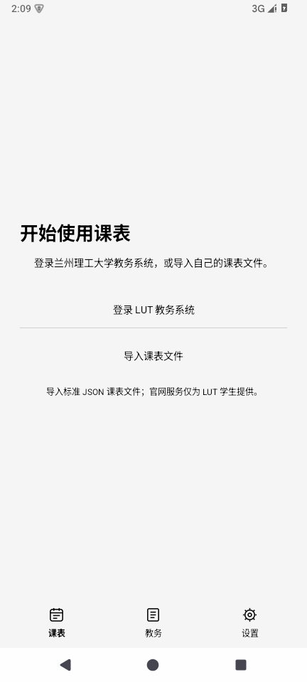
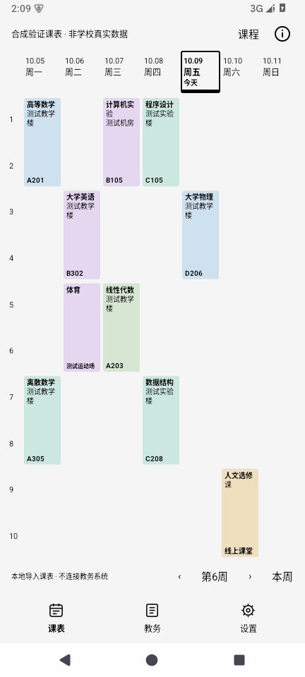
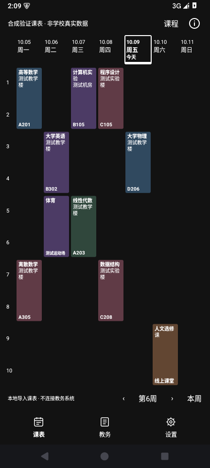
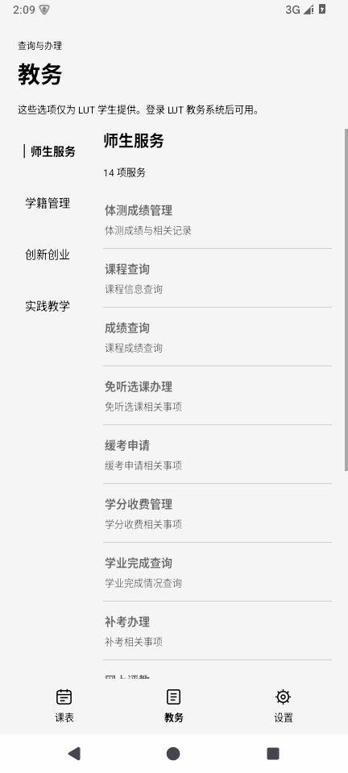

# 课间 · LUT 0.1.9-preview

兰州理工大学教务系统的个人非商业 Android 客户端。原生 Java，无第三方运行时依赖，Android 8.0+，targetSdk 36。非官方应用，不可商用。

[项目仓库](https://github.com/Enota13-name/LUTschedule) · [本版本源码](https://github.com/Enota13-name/LUTschedule/tree/release/0.1.9-preview) · [APK 安装包](https://github.com/Enota13-name/LUTschedule/raw/refs/heads/main/releases/LUT-Schedule-0.1.9-preview.apk)

## 本次调整

- 日期和星期直接显示在背景上，没有连接整条日期的底板；只有今天保留独立边框和“今天”文字。
- 当前页面的全屏背景按面积识别主色，所有 App 字体统一使用更清晰的黑色或白色；切页、换图、透明度和主题改变时重新计算。课程底色保留颜色并配合统一字体保持对比。官网页面由官网控制，App 不改写其样式。
- 首次使用显示「登录 LUT 教务系统」与「导入课表文件」。没有有效数据时不画空课表或虚构课程。删除演示模式和生成示例课程的功能。
- 导入成功后使用独立本地课表，旧官网缓存不会覆盖它。23 项教务服务全部不可用，并显示「这些选项仅为 LUT 学生提供」；不进行官网自动或后台同步。只有官网身份确认后才恢复官网模式。导入失败或取消保留旧数据。
- 删除设置的背景布局、官网小节、演示模式、官网连接详情条目。背景共用或分三份仍在全屏裁剪页选择，双指缩放与切页动画保留。
- 默认暗色课程加入暗绿、暗棕、暗蓝、暗紫和暗红；房间号独占卡片最底一行，长课程名不会挤掉这行。
- 开发者固定为 **Enota13**。单击不弹窗或出现按压效果；连续五次点击复制 **enota13official@gmail.com**，提示「你已经复制了开发者的邮箱，畅所欲言」。不会打开邮件客户端或发送邮件。该署名作为后续版本维护约定保留。
- App 弹窗继续使用 AppDialog；本地错误报告附对应源码分支，保留课程缓存和隐私脱敏。

## 原生实际截图（测试导入的合成课表）

| 首次使用 | 课表 | 默认暗色 | 导入后的教务限制 |
|---|---|---|---|
|  |  |  |  |

这些课表来自独立测试程序导入的合成 JSON，应用安装包不包含演示课程功能。

## 课表、提醒和缓存

课表由本地课程数据绘制，不嵌入官网课表。顶部显示日期、星期，左侧显示官网原始小节，没有整层方格线。较多小节可以滚动；已确认总小节数时保留空闲小节，否则以课程最大结束小节为准。考试放在对应日期的日程区域，显示真实起止时间、课程和地点；未核实官网小节时间映射前不猜测考试属于第几节。

背景覆盖整页和功能按钮范围。字体按整个当前页面的背景主色统一选择黑色或白色。课程可选稳定多色或自选纯色；纯色提供色盘、明度与十六进制输入。亮色、暗色、跟随系统可切换，保留轻微页面切换动画。

周数、上一周、下一周和本周控件放在下角。首次取得有效课表后选择惯用手，可在设置单独改成左下或右下。

官网登录模式下，每次打开、从其他 App 返回和手动刷新尝试更新。导入模式只显示本地文件。右上角合并加载、对号、红色叹号和刷新入口；点击可查看最近完整更新时间、尝试时间以及课表、成绩、考试分别的更新时间。三项核心数据都校验并保存后才显示完整同步成功；单项失败保留其有效缓存，不把失败当空数据覆盖。

第一次有效成绩读取建立基线，已有历史成绩不全部提醒。后续新增成绩或已发布分数变更进入持久化未读队列：前台显示顶部提示，用户允许通知后发送 Android 消息，同一变化不重复投递。考试变化更新课表并保留未读记录。没有评教消息提醒，官网入口仍可使用。

## 一次静默后台更新

仅官网登录模式使用。以北京时间计算，最后一次实际操作满 24 小时之后的第一个 08:00 安排一次 JobScheduler 任务，连续多天闲置只执行这一次。新的 App 操作开始新的闲置周期。

例如最后操作为 10 月 9 日 14:30，24 小时到期为 10 月 10 日 14:30，计划检查为 10 月 11 日 08:00。后台只写缓存和未读队列，不发送通知、声音、振动或登录弹窗，下次打开才提示。没有常驻服务或精确闹钟。Android 省电、网络和小米后台管理可能延后执行；强行停止 App 后需再次打开才能重新安排。

## 设置与权限

设置按外观、课表与操作、同步与提醒、数据与隐私、关于与排查、错误报告分组。通知授权的用途在对应控制中说明。

| 权限或访问方式 | 功能 |
|---|---|
| INTERNET | 官网登录、页面与只读数据查询 |
| ACCESS_NETWORK_STATE | 区分设备离线与官网连接失败 |
| POST_NOTIFICATIONS | 新成绩 Android 通知；不授予仍有前台提示 |
| RECEIVE_BOOT_COMPLETED | 配合 JobScheduler 保留后台任务 |
| 系统文件选择器的临时文件授权 | 只读取用户选择的背景或导入文件，不申请全部相册权限 |

开发者署名固定为 Enota13。密码只在官网页面中输入，不复制到聊天或源码。会话、图片与查询缓存保存在本机。连接失败区分离线、登录失效、HTTP 错误、解析失败等；不将所有网络失败断言为官网崩溃。没有忽略 SSL 证书校验。

## 已验证的范围

2026-10-09 在用户自行登录的浏览器中，只读查看了门户目录和课表、成绩、考试页面，并核对官网公开前端脚本中的查询路径、字段、分页与校历逻辑；没有提交评教、申请、收费、选课或修改记录。具体目录和接口来源见《教务目录映射.md》。没有将浏览器登录会话导出或写入安装包。

验证记录见 verification.json 和 tests/android/runtime-0.1.9-result.txt。109 项核心、7 项脱敏、180 项 Android 集成断言通过。当前验证使用 Android 15 自有模拟器、合成导入文件和合成官网响应，生产入口另行冷启动检查。截图为实际原生运行截图，使用合成数据，不包含学校真实成绩。

**手机 App 内真实账号的完整同步、全部 23 个业务流程、小米 15 Pro 实机表现尚未验证。** 浏览器登录成功不等于手机 App 已登录；用户需要在手机 App 的官网页面完成登录。接口或布局变化、业务权限、身份选择可能使部分服务无法读取，此时保留缓存并记录失败。

自动缓存范围为课表、成绩、考试，以及体测、课程查询、学分收费、学业完成、成绩认定等可识别的查询页文字。其余服务提供直达官网入口，不承诺完整离线复制教务系统所有私有内容，也不自动提交业务表单。

成绩和考试以可取得的账号标识或本机网页登录会话摘要建立比较范围。课表缓存尚未全面按账号隔离，切换账号前请使用设置中的「清除数据并退出账号」。学期外无法取得可靠校历日期时可能需要在设置校正第一教学周周一；不会默默编造日期。

## 构建与复核

`build-offline.ps1` 用本机 JDK 与 Android SDK，无需下载 Gradle。默认 0.1.9-preview/versionCode 10；需 SDK build-tools 36.0.0 与平台 android-37 或 android-37.0。JDK 路径以参数指定。Gradle 路径作为项目配置保留，本次未执行。

```powershell
.\build-offline.ps1 -JdkPath $env:JAVA_HOME -SdkPath "$env:LOCALAPPDATA\Android\Sdk"
```

私钥不公开，首次本地构建会在 build/offline 生成自己的测试签名；它不能覆盖安装本任务已签名的 APK。交付安装包沿用前版签名，可直接覆盖原预览版。项目外的 APK 输出位于项目父目录。

构建运行 109 项核心检查与 7 项报告脱敏检查。当前 Android 合成集成套件与运行命令见 [tests/android/README.md](tests/android/README.md)，只在专门模拟器运行。详细检查记录、APK 哈希、签名与实机限制见 verification.json。维护错误报告先读 [docs/ERROR_REPORTS.md](docs/ERROR_REPORTS.md)。
