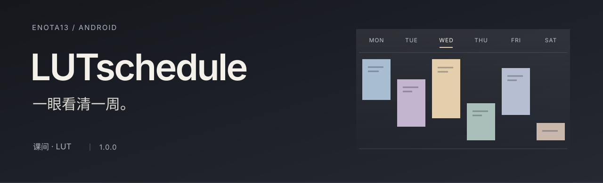
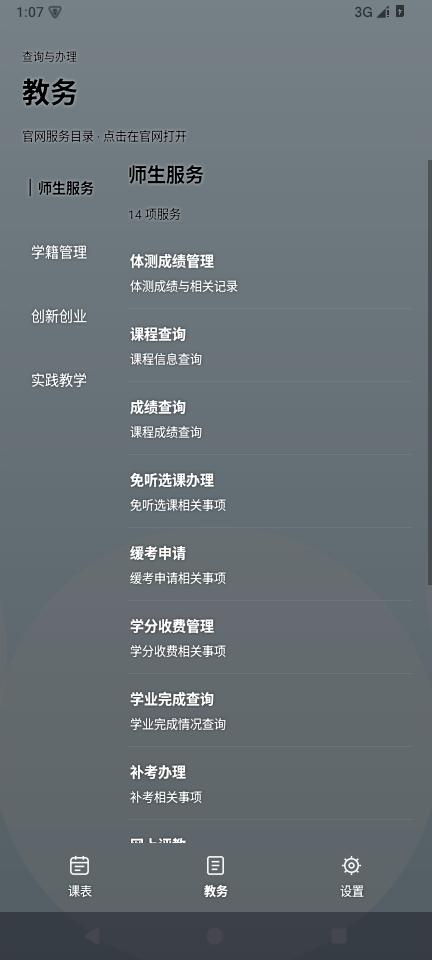
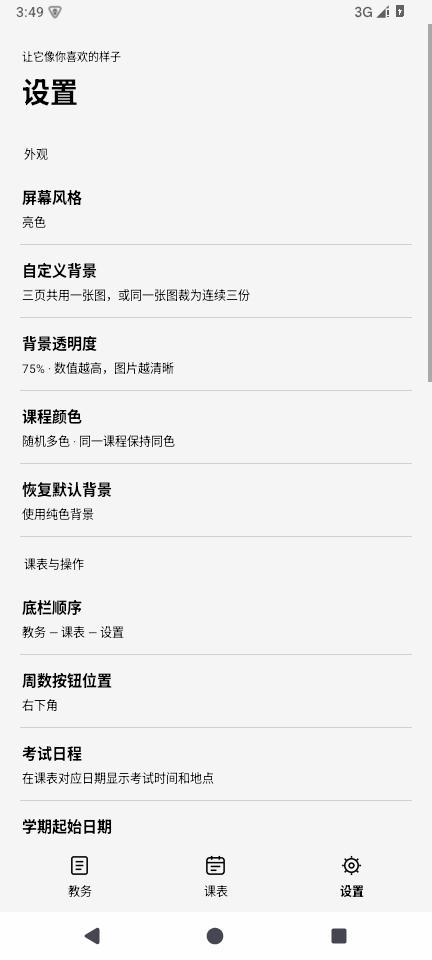

为兰州理工大学校园生活设计的轻量 Android 课表应用。

<a href="https://github.com/Enota13-name/LUTschedule/releases/latest"><strong>下载 APK</strong></a>
&nbsp; · &nbsp;
<a href="docs/FEATURES.md">探索功能</a>
&nbsp; · &nbsp;
<a href="https://github.com/Enota13-name/LUTschedule/releases/tag/v1.0.1">版本详情</a>

<strong>1.0.1</strong> &nbsp; / &nbsp; Android 8.0+ &nbsp; / &nbsp; 253 KiB &nbsp; / &nbsp; 原生 Java

## 一周的安排，清楚地放在眼前

打开即是课表。课程、教室与考试时间各有位置，今天的安排一眼可见。教务入口、自定义背景和常用操作围绕这张课表展开，让每天反复查看的几件事更顺手。

<table>
<tr>
<td align="center"></td>
<td align="center"></td>
<td align="center"></td>
</tr>
<tr>
<td align="center"><strong>课表</strong> 课程与考试，落在对应日期</td>
<td align="center"><strong>教务</strong> 按类别直达官方服务</td>
<td align="center"><strong>设置</strong> 把常用操作调整成你的习惯</td>
</tr>
</table>

以上为实际 Android 界面截图，使用合成数据，不含真实学生记录。

## 细节，为每天的使用服务

| 体验 | 设计 |
|---|---|
| **清楚的时间与地点** | 保留实际小节、周次与单双周；今天独立标记，日期之间没有连成一条的底板。课程房间号固定在最底行，考试显示具体日期与起止时间。 |
| **连贯的个人风格** | 自定义背景覆盖三个页面，支持双指缩放与裁剪、共用一张或连续三份。字体跨页保持同色，页面切换带有短动画。亮暗风格、多色课程与纯色色盘均可选择。 |
| **顺手的页面与操作** | 默认「教务 — 课表 — 设置」，支持六种底栏排列。每次启动始终进入课表；周数操作可放在左下角或右下角。 |
| **明确的更新状态** | 官网模式打开时更新，失败保留有效缓存，状态按钮可查看更新时间。新成绩提供顶部提示与允许后的系统通知；闲置后的单次早八检查仅更新缓存。 |
| **教务服务直达** | 23 项教务服务按官网类别排列，在全屏 WebView 中打开对应页面；「我的课表」返回原生主页。 |

## 从你的课表开始

首次打开时，可以选择两种数据来源：

- **登录 LUT 教务系统**：在官方网页自行登录，确认会话后自动进入个人课表采集流程。
- **导入本地课表**：使用[标准 JSON 文件](docs/IMPORT_FORMAT.md)。导入模式独立保存数据，教务入口不可用，也不会执行官网后台同步。

课表由已验证的官网数据或导入文件构建。官网登录与所有教务业务页面均以全屏呈现。

## 轻量，也对数据保持克制

原生 Java 实现，无第三方运行时、广告或统计 SDK。教务数据与背景保存在本机，错误报告由用户自行复制分享。自动采集限于已适配的只读查询，不自动办理评教、选课、申请或收费。

## 正式版与验证

当前正式版为 **1.0.1**，首页和下载区只展示这一版本。应用名称为「牛逼课表」，图标主体居中，安装包沿用本项目签名，支持覆盖安装。

**本次通过 123 项核心检查、7 项报告脱敏检查和 136 项 Android 界面断言。** 生产入口冷启动与网络等待检查通过，图标与署名已核验。官网协议、通知及后台逻辑沿用已有验证，本次未重复执行对应测试。

小米 15 Pro 实机及 App 内真实学校账号全量同步尚未完成验证；后台检查的实际执行时间受 Android 节电策略影响。完整证据与范围见 [verification.json](verification.json)。

## 项目文档

| 阅读方向 | 文档 |
|---|---|
| 已知问题 | [同步与存储待修复项](docs/KNOWN_ISSUES.md) |
| 使用与体验 | [重点功能与截图](docs/FEATURES.md) · [课表导入格式](docs/IMPORT_FORMAT.md) |
| 需求与设计过程 | [最终需求提示词](docs/FINAL_PROMPT.md) · [Vibe coding 复盘](docs/VIBE_CODING_REVIEW.md) |
| 开发与维护 | [构建与验证](docs/DEVELOPMENT.md) · [错误报告排查](docs/ERROR_REPORTS.md) · [图标素材说明](docs/ICON.md) |

一条非常直接的设计评审

> 你把github的介绍写的高大上一点好不好，现在显得好廉价

——来自需求方。于是，这个 README 也终于有了自己的设计任务。

---

<strong>Enota13</strong> 
app图标作者：他不想署名 
牛逼课表 · 非官方应用 · 不可商用 
<a href="NOTICE.txt">使用声明</a>

