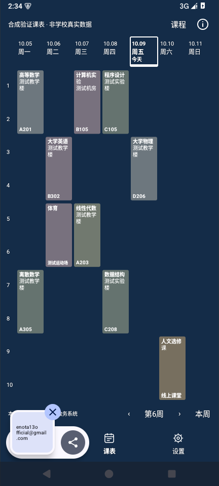
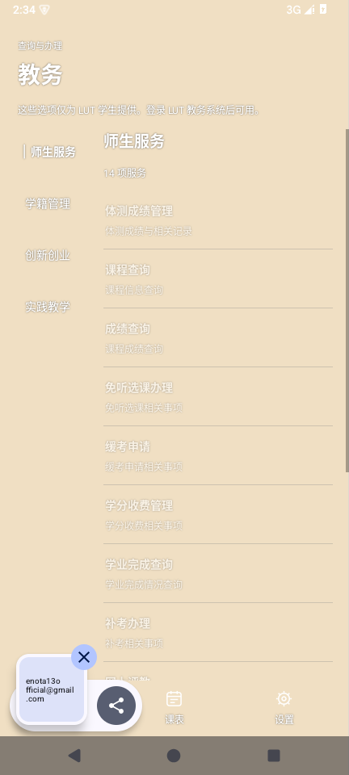
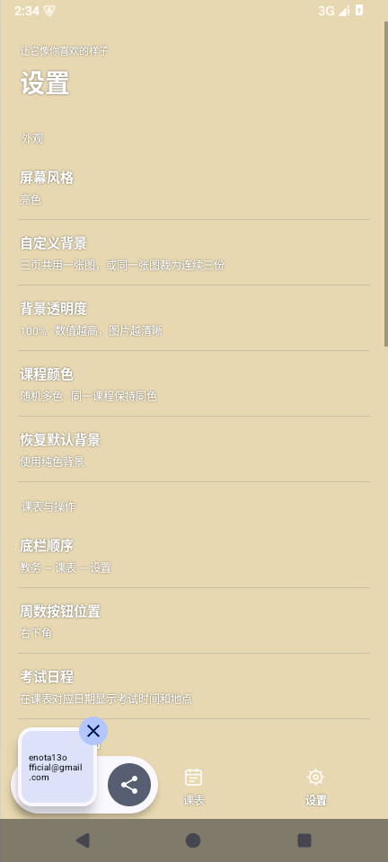
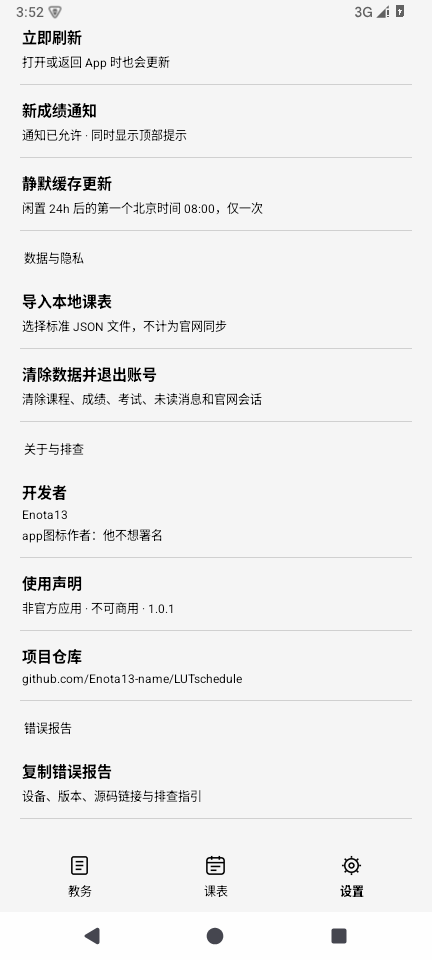

# 你重点修改的内容

## 每次打开都回到自己的课表

官网提供数据，App 本地绘制课表。实际小节、日期、星期、单双周和冲突课程各自保留，不再用固定六行压缩官网内容。移去多余标题和方格，日期之间没有连接底板，仅今天有独立标记。课程房间号固定在最底行，减少从楼宇文字里寻找数字的负担。考试出现在对应日期，显示真实起止时间；没有可靠节次对照时保留时间。

## 三页一致的背景与字体

自定义图片铺满三个页面与操作按钮，可双指缩放、单指移动并按屏幕比例裁剪。共用一张或裁为连续三份都在保存前预览。三份顺序跟随底栏，从左到右；切换有短动画。

三页共同计算背景主要色系，只使用同一种黑字或白字。切换页面不会翻转字体颜色；课块底色随统一字体保持对比。暗色通用界面为灰黑，课程仍包含多种暗色彩。色盘旁有实时课程示例，纯色或稳定随机多色可选。

| 同一背景的课表 | 教务 | 设置 |
|---|---|---|
|  |  |  |

## 菜单和操作按你的习惯排列

默认教务在左、课表在中、设置在右。设置中的「底栏顺序」提供全部六种排列，保存后仍停留当前页面，每次启动仍打开课表。周数操作集中在下角，惯用手和左右位置分别决定默认值与个人调整。教务和设置以分组文字为主，减少圆角卡片；App 自有弹窗使用统一简洁样式，官网页面和裁剪铺满屏幕。

## 登录入口与导入入口分清楚

首次没有课表时明确选择登录或导入。官网确认登录后自动进入课表采集；23 项教务目录按实际大类排列，直接打开对应全屏官方功能，其中「我的课表」回原生主页。自动采集只读取已适配查询，不办理业务。

导入文件后教务项目全部禁用，并解释仅供 LUT 学生使用；不会夹入官网成绩/考试缓存、自动连接官网，迟到的后台响应也不能改回官网模式。没有有效数据不造课程，不保留演示模式。

## 更新状态与提醒有明确含义

打开或返回官网模式时加载，全部核心数据校验保存后才显示对号；失败显示红叹号并保留各自有效缓存。点击可看最近完整更新、各模块及尝试时间。网络不可达不直接断言服务器崩溃。

新成绩用顶部提示和允许后的 Android 通知，基线不刷历史成绩，通知去重、锁屏不暴露成绩。取消评教提醒。考试直接更新课表。闲置满 24 小时后的第一个北京时间早八只安排一次缓存检查，下次打开再提示；实际执行受 Android 和小米节电策略影响。

## 简洁设置、明确署名和可用诊断

设置按功能分组，删去已取消的四项设置和权限系统分支。必要权限说明放回相关功能子页。底部可复制本地脱敏错误报告，带准确版本、仓库和源码链接，正常错误弹提示，致命错误下次启动恢复，不自动上传。

开发者 Enota13 永久固定，标明不可商用；其下显示「app图标作者：他不想署名」。署名单击无反馈，连续五次点击复制邮箱并显示你指定的句子，不触发邮件发送。应用名称为「牛逼课表」，图标主体居中。

以上功能说明不把官网入口核对或合成测试当作实机全量同步证明；正式验证范围见 [../verification.json](../verification.json)。
